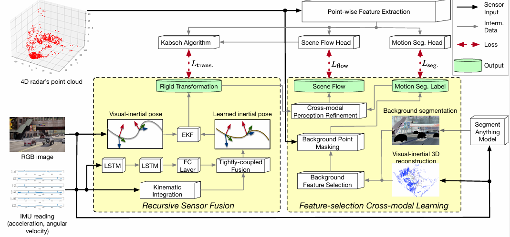
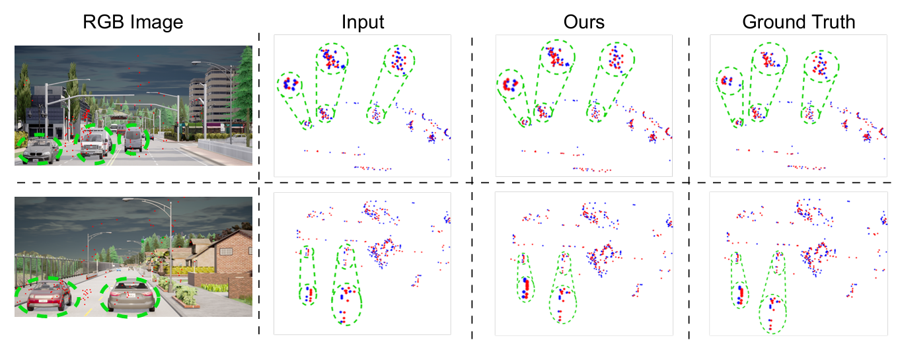
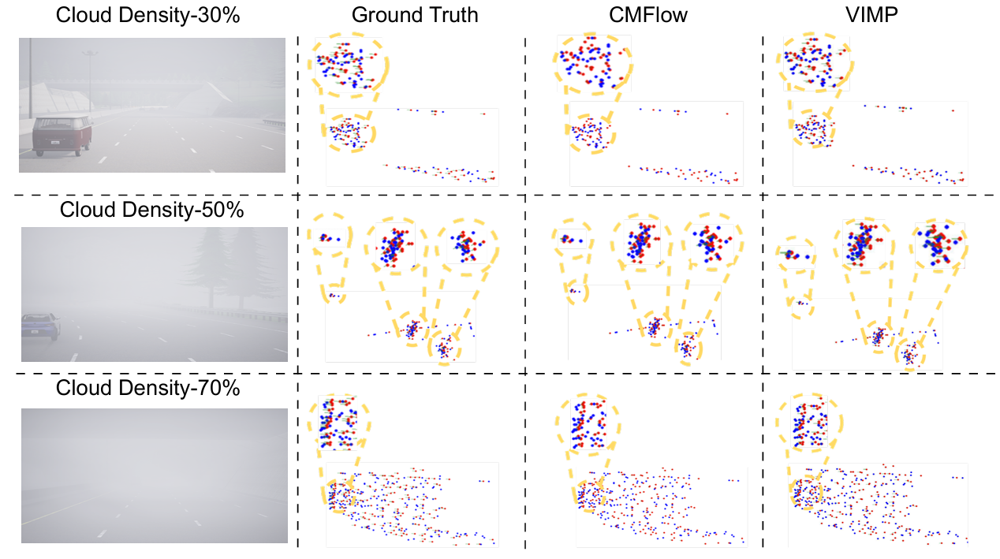
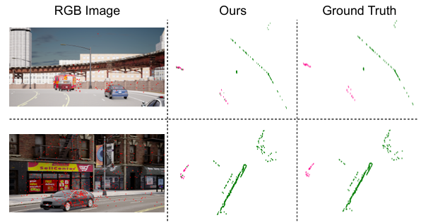
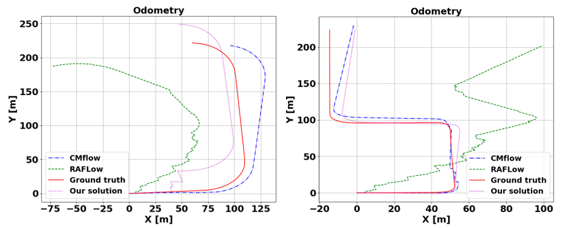

# MmWave Radar Perception Learning using Pervasive Visual-Inertial Supervision

**[Yiwen Zhou](#)**, **[Shengkai Zhang](#)**  
*Wuhan University of technology*

---

This repository is an official PyTorch implementation of the paper *"MmWave Radar Perception Learning using Pervasive Visual-Inertial Supervision"*, which is a radar perception learning framework guided by a pervasive visual-inertial(VI) sensor suite, tracking  moving objects in the lack of 3D observations.

---

## Overview

VIMP consists of two designs. First, we propose a recursive sensor fusion method that recursively uses the IMU measurements to compensate for the temporal drift of VIO. Second, we propose a feature-selection cross-modal learning framework. It first selects background visual features to supervise the radar’s point cloud reliably.

---

## Qualitative evaluation of novel scene flow estimation on synthetic dataset.

## Qualitative evaluation of motion segmentation and pose estimation on synthetic and real-world dataset.

| motion segmentation                  | pose estimation                   |
|-------------------------|-------------------------|
|  |  |
